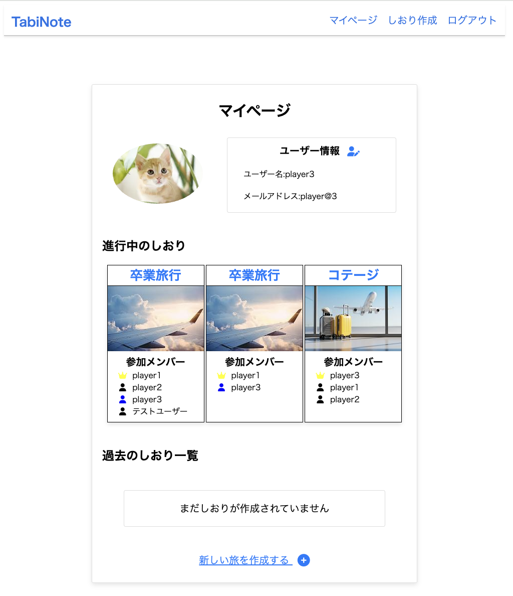
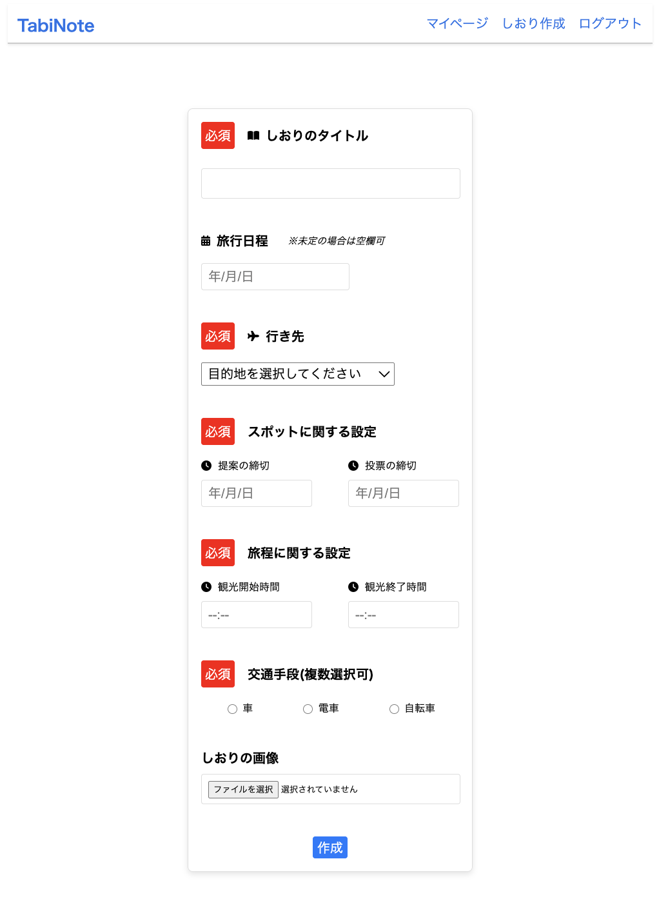
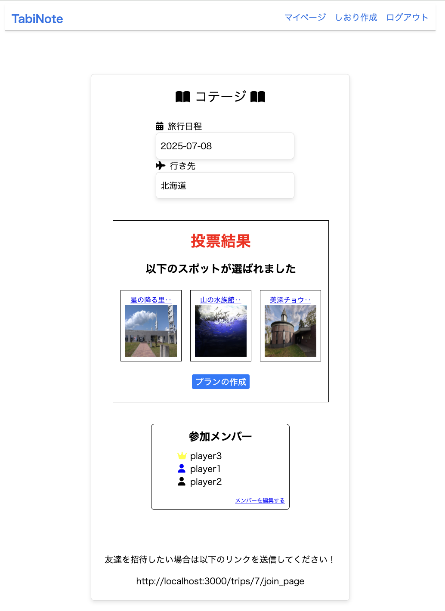

## 概要

**TabiNote** は、複数人での旅行プランをスムーズに決められる「旅のしおり作成・共有アプリ」です。

幹事が旅行の基本情報を作成し、メンバーは候補スポットの提案や**NG投票**を行うことで、全員の希望を取り入れた最適な旅行プランを自動で生成します。

[▶ ランディングページを見る](https://tabinote-5f323d6eb545.herokuapp.com/)

## このサービスを作った理由

旅行計画では、「どこでもいいよ」「合わせるよ」といった曖昧な意見が多く、なかなか行き先が決まらなかったり、後から「そこはちょっと…」という否定的な意見が出て、話がまとまらないことがあります。

私自身も友人や恋人との旅行でこのような経験を何度もしてきました。

そこで、「行きたい場所」と「行きたくない場所」の両方をうまく反映し、全員が納得できる旅行プランを自動で作成できるツールを作りたいと考えました。

本アプリでは、メンバーのスポット提案とNG投票から情報を収集し、TSP（巡回セールスマン問題）に基づいた最適ルートを自動で生成します。
幹事の負担を減らしながら、参加者全員の意見を反映した旅行計画を、より簡単に・効率的に作成することが可能になります。

## 解決したかった課題
- 旅行計画がなかなか決まらない
→ 人任せになったり、メンバー間で意見がまとまらず、話し合いが長引きがち。

- 「行きたくない場所」の意見が反映されにくい  
→ 「特に行きたい場所はないけど、ここは嫌だ」という消極的意見は見落とされがち。

- 幹事の負担が大きい  
→ 候補の集約・意見調整・ルート設計まで、幹事がすべて対応する必要があるため、心理的・作業的な負荷が高い。

## 主な機能（ユーザー視点）
- 旅行グループ（しおり）の作成・編集
- 幹事の交代 / メンバーの編集
- メンバーの招待・参加（招待コード）
- スポットの提案／NG投票
- 自動ルート計算による旅行プランの生成（複数案）
- しおりの共有・閲覧・編集（幹事のみ編集可）

## 設計資料（Figma画面遷移図）

ユーザー体験と機能実装の整合性を意識し、事前にFigmaで画面遷移図を設計しました。  
幹事とメンバーで異なる導線、投票や提案機能などの流れを可視化しています。

その後、実装・動作検証・などの過程で一部UIや画面構成を調整しています。  

 [Figmaで画面遷移図を見る](https://www.figma.com/design/nWrF2LHOQCF1K2uFflO280/%E3%83%9D%E3%83%BC%E3%83%88%E3%83%95%E3%82%A9%E3%83%AA%E3%82%AA?node-id=0-1&p=f&t=GFgWijwNootn70jU-0)

## 他サービスとの違い（差別化ポイント）

### 1. NG投票による「消極的な意見の可視化」
- 単なる「行きたい場所」だけでなく、「行きたくない場所」も反映される投票方式
- 少数意見や遠慮しがちな不満が計画に反映され、より満足度の高い旅行を実現

### 2. TSPアルゴリズムによる最適ルート提案
- Google Maps API の距離データと組み合わせて、移動効率の良い順路を自動で計算
- 幹事がルートを手動で組む必要がなくなり、負担を大幅に軽減

### 3. スポット提案＋NG投票の組み合わせ
- メンバー全員が参加できる設計
- 提案されたスポットの中から「全員が許容できる」場所のみを抽出

## サービスの利用イメージ

1. **しおりの作成（幹事）**
   - 幹事が旅行のタイトル・日程・目的地などを入力し、旅行グループ（しおり）を作成します。

2. **メンバーの参加**
   - 各メンバーがアカウントを作成し、幹事から共有された「招待URL」を使ってグループに参加します。

3. **スポットの提案（全員）**
   - 行きたい場所・やってみたいことなど、各メンバーが自由にスポットを提案します。

4. **NG投票（全員）**
   - 提案されたスポットの中で「行きたくない場所」があれば、NG票を投じることができます。

5. **不人気スポットの除外**
   - 一定数以上NG票が集まったスポット(全体の3割以上NGが入ったスポット)は自動で除外

6. **旅行プランの自動生成**
   - Google Maps API の距離データと TSP アルゴリズムを用いて、効率よく回れる旅行プランを自動生成（複数案提示）。

7. **最終決定**
   - 幹事の判断で最終プランを決定します。

8. **しおりの編集と共有**
   - 決定したしおりは幹事が必要に応じて編集でき、全メンバーがいつでも確認・共有できます。

## 画面イメージ

### マイページ

### しおり作成画面

### スポット提案画面

### スポット投票画面

### 投票結果画面

## テストログイン情報

| メールアドレス     | パスワード |
|--------------------|------------|
| player@1 | 123456     |
| player@2 | 123456     |

## プラン提案ロジックの概要

本アプリでは、メンバーから提案されたスポットに対してNG投票で不要なスポットを除外した後、以下の流れで旅行プラン（最適な観光ルート）を自動生成しています。

**ステップ1：最大スポット訪問を実現する最適ルートの算出**

旅行の「出発時間」と「終了時間」から利用可能な観光時間を算出。

提案スポットの移動距離（Google Distance Matrix API）と各スポットの滞在時間をもとに、
旅行時間内でもっとも多くのスポットを効率的に回れるルートを探索（TSPアルゴリズムを応用）。

**ステップ2：除外されたスポットの保存**

上記の探索で訪問できなかったスポットがある場合、それらを must_include_spots として一時保存。

**ステップ3：省かれたスポットを含む代替ルートの生成**

must_include_spots が存在する場合、それらのスポットを1つずつ必ず含める条件で再探索を実施。

各スポットについて「このスポットが含まれる中で最適なルート」を1つずつ生成（each doで反復処理）。
(スポットの滞在時間と移動時間の合計値を考慮)

**ステップ4：代替ルートの登録**

ステップ3で生成した複数のルートはすべて PlanSpot モデルを通じてDBに保存され、各プランとして登録される。

これにより、全員の希望をできる限り反映した複数の旅行プラン案が提示可能となる。

## 使用技術

### フロントエンド
- HTML / SCSS 
- JavaScript（非同期処理あり）

### バックエンド
- Rails 8
- Devise（認証）

### インフラ
- Heroku（本番環境）
- MySQL
- AWS S3（画像アップロード）

### 外部API
- Google Places API
- Google Maps Distance Matrix API

## 設計のこだわり

- **スポット提案とNG投票機能によるUX向上**  
  - メンバー全員が参加する設計により、幹事だけに負担をかけない体験を実現。
  - NG投票を行うことにより「ここには行きたくない」という意見を取り入れたプラン提案を実現

- **Google APIを活用した自動ルート最適化**  
  - ユーザーの「移動時間の効率化」を意識し、最適ルートをアルゴリズムで選出。
  - 投票結果に含まれるスポットが必ず含まれるように複数のプランを提案

- **2回目以降の検索時にはDB検索を実施**  
  同じ目的地＋キーワードでの再検索を高速化 + APIを叩く回数を減らすために実装

## 今後の展望
- テストコード（RSpec）導入によるCI整備
- 市区町村単位へのスポット検索対応（API検索の精度強化）
- 電車・飛行機など複数交通手段の対応
- スポット提案がない場合の自動プラン提案のアルゴリズムを導入
- モバイル端末からの利用をより快適にするためのUI改善・レスポンシブ対応強化

---
